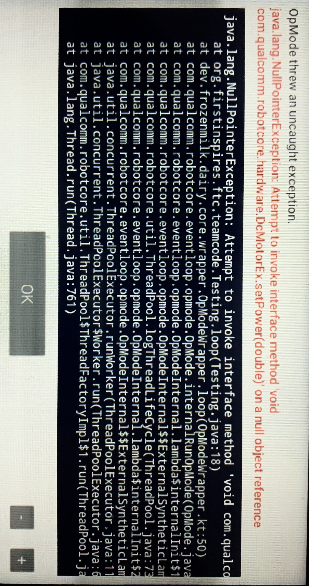

# [`NullPointerException`](https://docs.oracle.com/javase/8/docs/api/java/lang/NullPointerException.html) on initialization

## What does it look like?
The general format of the error is:
```
java.lang.NullPointerException: Attempt to invoke [...] on a null object reference
```

On the Driver Station, you may see a stacktrace similar to this:


<div style="text-align: center;"><em>A stacktrace of the Driver Station with a NPE.</em></div>

## Why does this happen?
First, we need to understand more about how Java works a little more in depth.
> This section is a little lengthy, feel free to scroll below for the solution.

When we program in Java, we have expressions, which have a certain **type**.
The type tells us about the properties of said expression.

This lets us add `int`s, set the power of a `DcMotor`, or check if a `boolean` is true!

Type systems also give us a degree of validity; we can't add servos to booleans.

> The following is a very generalized description with oversights, but is sufficient for conceptual understanding.

In Java, there are two categories of types:
  - Primitive Types
    - Primitives are not objects, and do not have methods, only a value.
    - Primitives are passed by value.
    - `int`, `double`, and `boolean`, are examples of primitives.
  - Reference Types
    - All types that extend `Object` are passed by reference, and hence, reference types.
    - All objects are passed by reference.
    - `class`es, `interface`s, `enum`s, arrays

> ### **What does it mean to pass/store an object by value or reference?**
> 
> **Storing by Value:**
> - You are storing the actual value of the variable in memory. 
> - This means that when you assign one variable to another, a copy of the value is made. 
> - Changes to one variable do not affect the other.
> - ```java
>   int bobMoney = 20;
>   int jeffMoney = bobMoney; // "jeffMoney" gets the value of "bobMoney", not a reference to "bobMoney"
>   
>   jeffMoney = 10; // changing "jeffMoney" does not affect "bobMoney"
>   
>   System.out.println(bobMoney); // 20
>   ```
> **Storing by Reference:**
> - You are storing a reference or memory address to the location where the actual data is stored.
> - This means that when you assign one variable to another, they both point to the same memory location.
> - Changes to one variable will affect the other because they both refer to the same data.
> - ```java
>   Person bob = new Person("bob", 18);
>   Person anon = bob; // "anon" now refers to the same object as "bob"
>   
>   anon.setAge(21); // changing "anon" also changes "bob"
>   
>   System.out.println(bob.getAge()); // 21
>   ```

`null` really refers to a null **reference**. This means any `Object` can have a `null` value. 

Any uninitialized `Object` has no reference to point to; a null reference, or `null`.
NPEs occur when you try to use the typed properties of an object while it points to nothing. 
This is so no undefined behavior occurs. 

Java does not provide any means of "null-safety", and so it is the responsibility of the programmer to check for and handle potential null values.

FTC specific examples include trying to access the `hardwareMap` at instantiation, or just never assigning a value to a `HardwareDevice`.

## How can I fix it?

It is important to note that NPEs are a very common, generic exception.
In FTC, by far the majority of the sources of NPEs is because of when hardware devices are accessible.
  - Hardware devices are **NOT** accessible at class instantiation; that is, one **cannot** do the following:
    - ```java
      @TeleOp
      public class Testing extends OpMode {
          private DcMotor motor = hardwareMap.get(DcMotor.class, "motor");
  
          @Override
          public void init() { } // it's always a red flag if the init is empty!
  
          @Override
          public void loop() { motor.setPower(1.0); }
      }
      ```
    - This will fail by saying that the `hardwareMap` reference itself is null, which will lead to a NPE.
 - Hardware devices only start to become accessible:
    - For `OpMode`s: during and after `init()`, have all inits there 
    - ```java
      @TeleOp
      public class Testing extends OpMode {
          private DcMotor motor;
   
          @Override
          public void init() { hardwareMap.get(DcMotor.class, "motor"); }
   
          @Override
          public void loop() { motor.setPower(1.0); }
      }
      ```
   - For `LinearOpMode`s: in `runOpMode()`, have inits before `waitForStart()`

*Last updated: 2024-03-28*